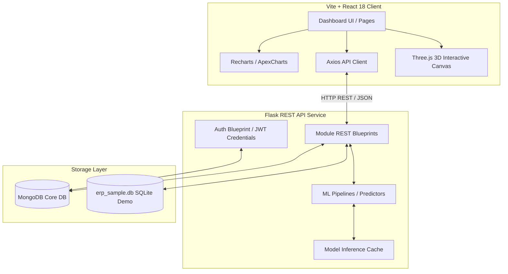
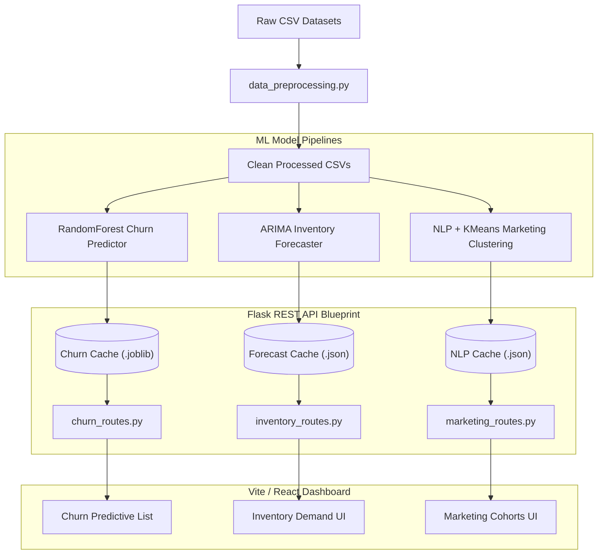

# 🌌 Retail AI Suite

[](https://react.dev/)
[](https://vitejs.dev/)
[](https://flask.palletsprojects.com/)
[](https://www.python.org/)
[](https://www.mongodb.com/)
[](https://threejs.org/)

Retail AI Suite is a full-stack, enterprise-grade decision support platform designed to optimize retail operations. It combines an asynchronous Flask/MongoDB backend, automated machine-learning pipelines, and an interactive Vite/React dashboard for predicting customer churn, forecasting inventory demand, NLP-enhanced marketing segmentation, and revenue reporting.

---

## 🏗️ System Architecture

The application is structured as a decoupled Single Page Application (SPA) communicating over a secure JSON REST API, backed by MongoDB for raw transactions and cache storage, and SQLite for lightweight ERP connections:



---

## ⚙️ Data & Machine Learning Workflow

The data workflow automates cleaning raw retail streams and deploying models to a local inference cache:



---

## ⚡ Core Modules

- **🔮 Customer Churn Analytics:** Evaluates customer-level churn risk metrics using a `RandomForestClassifier` pipeline, generating retention risk signals, behavior summaries, and active CRM list filtering.
- **📈 Inventory Demand Forecasting:** Predicts upcoming inventory stock requirements using `ARIMA` time-series models, providing visual indicators of stockout risks, safety thresholds, and reorder signals.
- **🎯 Marketing Clustering & NLP:** Identifies customer clusters using `K-Means` clustering on Recency, Frequency, Monetary (RFM) metrics, paired with an NLP sentiment classifier analyzing feedback text.
- **📊 Revenue Analysis:** Processes transaction streams to generate sales analysis charts, sales trends, category performance, and enterprise ERP sync status.

---

## 📂 Project Directory Structure

```txt
fyp_codex_safe/
├── backend/
│   ├── api/             # Flask endpoints (Blueprints)
│   ├── database/        # DB connections and data seeders
│   ├── models/          # Churn, Inventory, and Marketing ML modules
│   ├── utils/           # Preprocessing and chart formatters
│   ├── data/            # Demo datasets (CSV)
│   ├── cache/           # Inference cache targets (.joblib/.json)
│   ├── reports/         # Detailed model audit & evaluation reports
│   └── app.py           # Application bootstrapper
├── frontend/
│   ├── public/          # Static assets
│   ├── src/
│   │   ├── api/         # Axios API connectors
│   │   ├── components/  # Layouts, Auth, Tables, and Reusable charts
│   │   ├── context/     # App settings & authentication state
│   │   └── pages/       # Dashboards and marketing pages
│   ├── package.json     # Node configurations
│   └── vite.config.js   # Vite server settings
├── docs/
│   ├── architecture/    # System design guides & setups
│   ├── screenshots/     # Final UI screenshots
│   ├── SOFTWARE_TEST_PLAN.md
│   └── TEST_CASES.md
└── README.md
```

---

## 🚀 Getting Started

### Backend Setup (Flask)

1. Navigate to the backend directory and activate your virtual environment:
   ```bash
   cd backend
   python -m venv .venv
   source .venv/bin/activate  # On Windows use: .venv\Scripts\activate
   ```
2. Install the backend dependencies:
   ```bash
   pip install -r requirements.txt
   ```
3. Run the development server:
   ```bash
   python app.py
   ```
   *Note: Environment dependencies can be further refined with `requirements-gpu.txt` for GPU acceleration or `requirements-nlp.txt` for text parsing models.*

### Frontend Setup (Vite / React)

1. Navigate to the frontend directory:
   ```bash
   cd ../frontend
   ```
2. Install npm modules:
   ```bash
   npm install
   ```
3. Start the Vite server:
   ```bash
   npm run dev
   ```
4. Build the production package:
   ```bash
   npm run build
   ```

---

## 🔒 Security & Ignored Artifacts
- **Secrets:** Raw credentials, JWT secret keys, and MongoDB URIs are configured in the root `.env` file (ignored by Git).
- **Databases:** Local SQLite databases (`*.db`, `*.sqlite`, `backend/erp_sample.db`) are excluded from repository history.
- **Cache:** Pre-trained model caches (`*.joblib`, `*.pkl`) are kept locally and not uploaded to GitHub.
