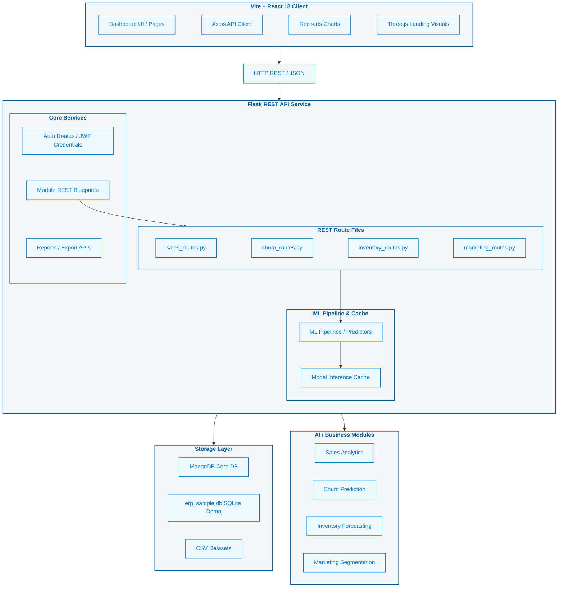
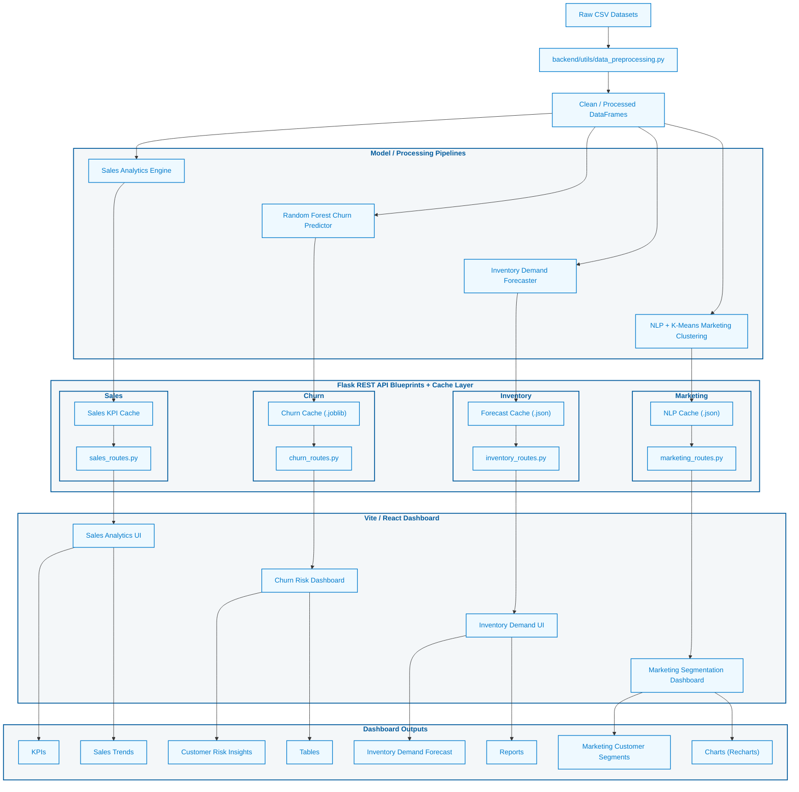

# 🌌 Retail AI Suite

<p align="center">
  <b>AI-Powered Retail Optimization Dashboard</b><br/>
  Customer Churn Prediction • Inventory Forecasting • Marketing Segmentation • Sales Analytics
</p>

<p align="center">
  
  
  
  
  
  
  
  
</p>

---

## 📌 Project Overview

**Retail AI Suite** is a full-stack AI-based decision support platform designed to optimize retail business operations. It combines a **Flask backend**, **MongoDB-based application storage**, **CSV-powered analytics datasets**, automated **machine learning pipelines**, and an interactive **Vite + React dashboard**.

The system helps retail businesses analyze sales performance, predict customer churn, forecast inventory demand, and segment customers for marketing decisions.

---

## ✨ Key Features

* 🔮 **Customer Churn Prediction**
  Identifies safe and at-risk customers using machine learning and customer behavior analysis.

* 📦 **Inventory Demand Forecasting**
  Forecasts product demand, detects low-stock risks, and supports reorder planning.

* 🎯 **Marketing Segmentation**
  Groups customers into meaningful segments using K-Means clustering and customer profile analysis.

* 📊 **Sales Analytics**
  Provides revenue insights, sales trends, category performance, and dashboard-ready KPIs.

* 📁 **CSV Dataset Processing**
  Reads, cleans, preprocesses, and analyzes retail datasets.

* ⚡ **Model Caching**
  Stores reusable model outputs and inference results to improve performance.

* 🔐 **Authentication System**
  Supports login, registration, protected routes, and user-based access flow.

* 📈 **Interactive Dashboard**
  Displays KPIs, charts, tables, reports, and business insights using a modern React interface.

---

## 🏗️ System Architecture

The application is structured as a decoupled Single Page Application that communicates with a Flask backend using JSON-based REST APIs. MongoDB is used for application and user-related data, SQLite is used for lightweight ERP/sample integration, and CSV datasets are used for analytics and machine-learning workflows.



---

## ⚙️ Data & Machine Learning Workflow

The data workflow starts from raw CSV datasets, applies preprocessing, runs module-specific analytics or machine-learning pipelines, stores reusable inference outputs in local cache files, and returns dashboard-ready KPIs, charts, tables, and reports through Flask API routes.



---

## 🧠 AI & Analytics Modules

### 🔮 Customer Churn Prediction

The churn module analyzes customer transaction behavior and identifies customers who are safe or at risk of churn.

**Main capabilities:**

* Customer-level churn classification
* Safe vs at-risk customer analysis
* Churn rate calculation
* Risk driver insights
* Customer filtering and dashboard list
* Cached model execution for faster repeated analysis

**Model / technique used:**

* Random Forest Classifier
* Customer-level grouping
* Feature-based churn behavior analysis

---

### 📦 Inventory Demand Forecasting

The inventory module predicts product demand and helps identify future stock risks.

**Main capabilities:**

* Demand forecasting
* Current stock analysis
* Low-stock alert detection
* Reorder suggestion logic
* Forecast KPIs and inventory charts
* Store, product, and region-based inventory insights

**Model / technique used:**

* Demand forecasting logic
* Time-based inventory analysis
* Stock and demand comparison

---

### 🎯 Marketing Segmentation

The marketing module groups customers into meaningful segments based on purchasing behavior and campaign response data.

**Main capabilities:**

* Customer segmentation
* Auto-K cluster selection
* Customer profile analysis
* Campaign response analysis
* Segment-based marketing insights
* NLP-assisted sentiment/display analysis

**Model / technique used:**

* K-Means Clustering
* RFM-style feature analysis
* NLP-based sentiment support

---

### 📊 Sales Analytics

The sales module provides business performance insights from retail transaction data.

**Main capabilities:**

* Revenue analysis
* Sales trend visualization
* Category performance
* Product performance
* KPI cards and dashboard charts
* Business reporting support

**Model / technique used:**

* Data aggregation
* KPI calculation
* Trend and category analysis

---

## 📊 Sample Dataset Highlights

| Module                 | Dataset Purpose                        | Key Output                                               |
| ---------------------- | -------------------------------------- | -------------------------------------------------------- |
| Customer Churn         | Customer transactions and churn labels | Safe customers, at-risk customers, churn percentage      |
| Inventory Forecasting  | Store, product, stock, and demand data | Demand forecast, low-stock alerts, reorder suggestions   |
| Marketing Segmentation | Campaign and customer profile data     | Customer groups, response insights, segment profiles     |
| Sales Analytics        | Retail sales transactions              | Revenue KPIs, sales trends, product/category performance |

---

## 🛠️ Tech Stack

### Frontend

| Technology       | Purpose                                        |
| ---------------- | ---------------------------------------------- |
| React 18         | User interface and dashboard pages             |
| Vite             | Fast frontend development and production build |
| JavaScript / JSX | Frontend logic and components                  |
| CSS              | Styling, layout, and responsiveness            |
| Recharts         | Dashboard charts and data visualizations       |
| Three.js         | Landing page visual elements                   |
| Framer Motion    | Smooth UI animations and transitions           |
| Axios            | API communication with Flask backend           |

### Backend

| Technology       | Purpose                                       |
| ---------------- | --------------------------------------------- |
| Python           | Backend, data processing, and AI logic        |
| Flask            | REST API service                              |
| Flask Blueprints | Modular API route structure                   |
| MongoDB          | User, authentication, and application data    |
| SQLite           | Lightweight ERP/sample database integration   |
| Pandas           | CSV reading, preprocessing, and data analysis |
| NumPy            | Numerical processing                          |
| Scikit-learn     | Machine learning models and evaluation        |
| Joblib           | Model serialization and caching               |

---

## 📂 Project Directory Structure

```txt
fyp_codex_safe/
├── backend/
│   ├── api/                 # Flask API endpoints and route blueprints
│   ├── cache/               # Model and inference cache files
│   ├── data/                # CSV datasets used by AI modules
│   ├── database/            # Database connections and seeders
│   ├── models/              # ML and analytics logic
│   ├── reports/             # Audit reports and exported outputs
│   ├── utils/               # Preprocessing, mappers, and helper utilities
│   └── app.py               # Flask application entry point
│
├── frontend/
│   ├── public/              # Static frontend assets
│   ├── src/
│   │   ├── api/             # Axios API connectors
│   │   ├── components/      # Reusable UI components
│   │   ├── context/         # App/auth/settings context
│   │   ├── pages/           # Dashboard and module pages
│   │   └── App.jsx          # Main React application
│   ├── package.json         # Frontend dependencies and scripts
│   └── vite.config.js       # Vite configuration
│
├── docs/
│   ├── architecture/        # Architecture and design documents
│   ├── screenshots/         # UI screenshots
│   ├── SOFTWARE_TEST_PLAN.md
│   └── TEST_CASES.md
│
└── README.md
```

---

## 🚀 Getting Started

### 1. Clone the repository

```bash
git clone <your-repository-url>
cd fyp_codex_safe
```

---

### 2. Backend Setup

Navigate to the backend folder:

```bash
cd backend
```

Create and activate a virtual environment:

```bash
python -m venv .venv
```

On Windows:

```bash
.venv\Scripts\activate
```

On macOS/Linux:

```bash
source .venv/bin/activate
```

Install backend dependencies:

```bash
pip install -r requirements.txt
```

Run the Flask server:

```bash
python app.py
```

The backend will start the Flask REST API service.

---

### 3. Frontend Setup

Open a new terminal and navigate to the frontend folder:

```bash
cd frontend
```

Install frontend dependencies:

```bash
npm install
```

Run the Vite development server:

```bash
npm run dev
```

Build the production version:

```bash
npm run build
```

---

## 🔐 Security & Ignored Artifacts

The project is configured to keep sensitive and machine-generated files out of version control.

Ignored or local-only artifacts include:

* `.env` files
* JWT secret keys
* MongoDB connection strings
* Local SQLite database files
* Model cache files such as `.joblib`, `.pkl`, and generated cache outputs
* Temporary logs and build artifacts

---

## 📈 Project Outcome

Retail AI Suite provides a complete AI-powered retail dashboard that supports:

* Better customer retention decisions
* Improved inventory planning
* Smarter marketing segmentation
* Faster sales performance analysis
* Centralized AI-based retail insights

The system is designed as a modular full-stack application where each AI module can be extended, improved, or replaced independently.

---

## 🎓 Final Year Project Context

This project was developed as a Final Year Project to demonstrate the use of modern full-stack development, machine learning, data preprocessing, dashboard visualization, and AI-assisted business decision support in the retail domain.

---

## 📜 License

This project is developed for academic and demonstration purposes.

---

<p align="center">
  <b>Retail AI Suite</b><br/>
  AI-Powered Decision Support for Modern Retail Operations
</p>
